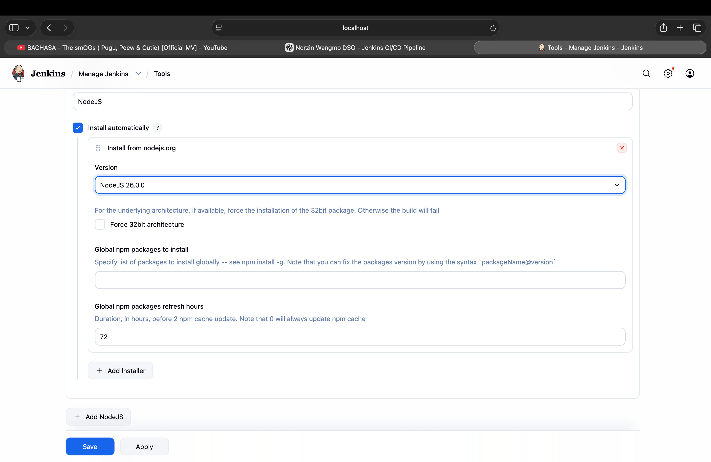
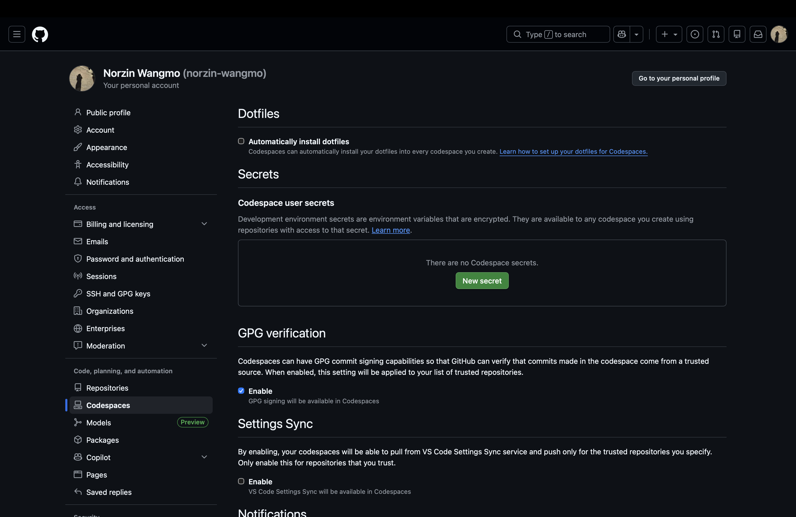
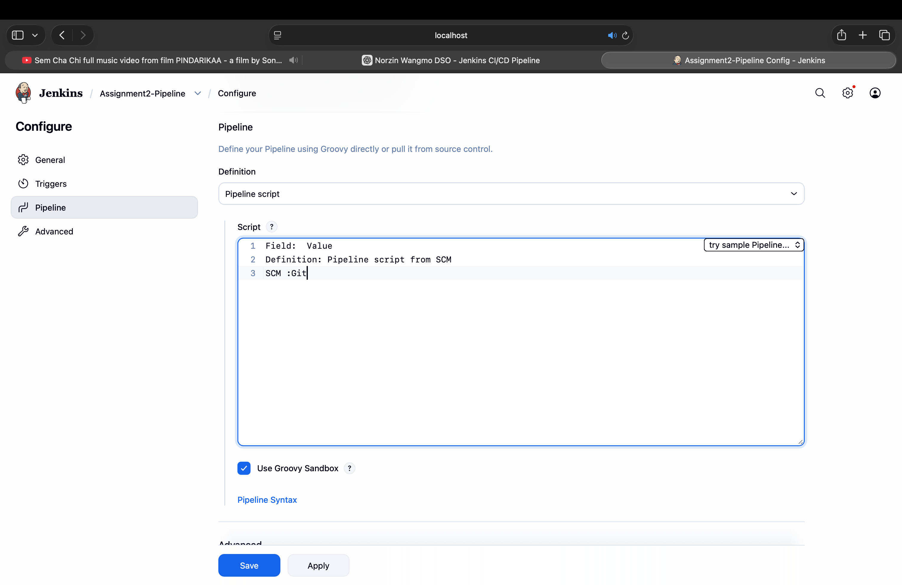
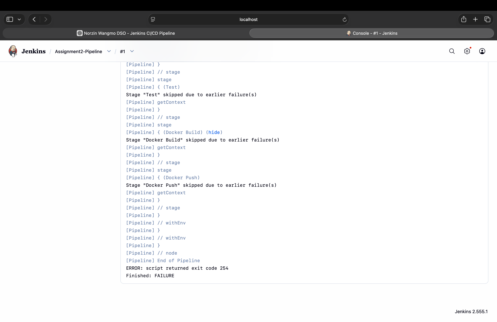
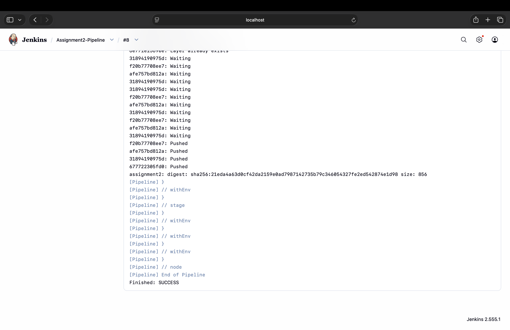
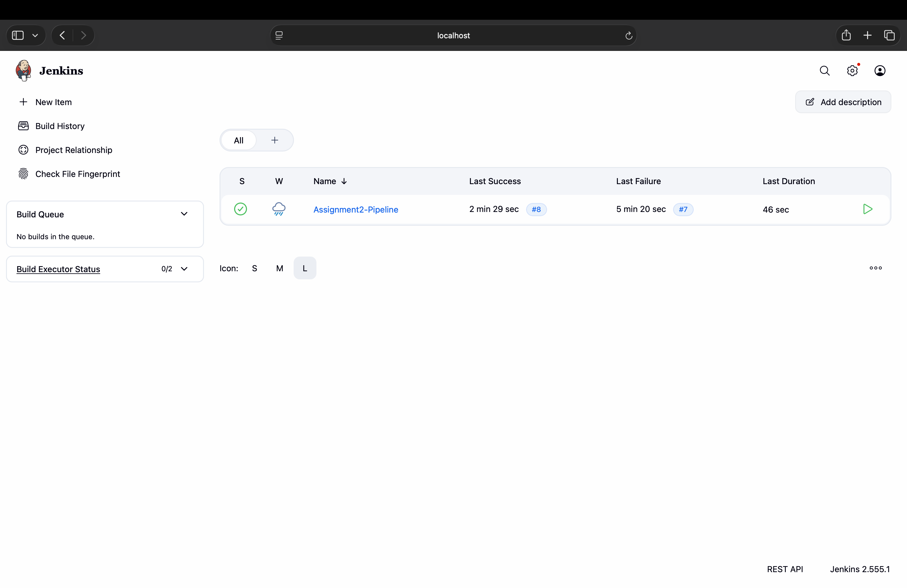
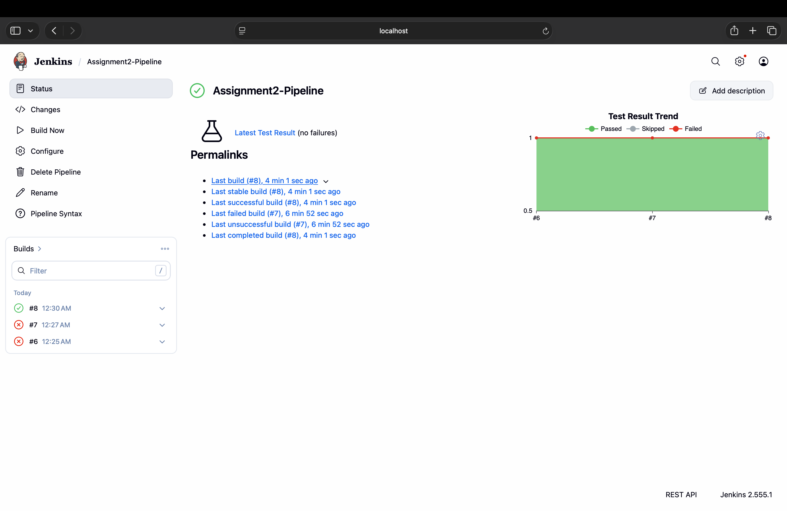
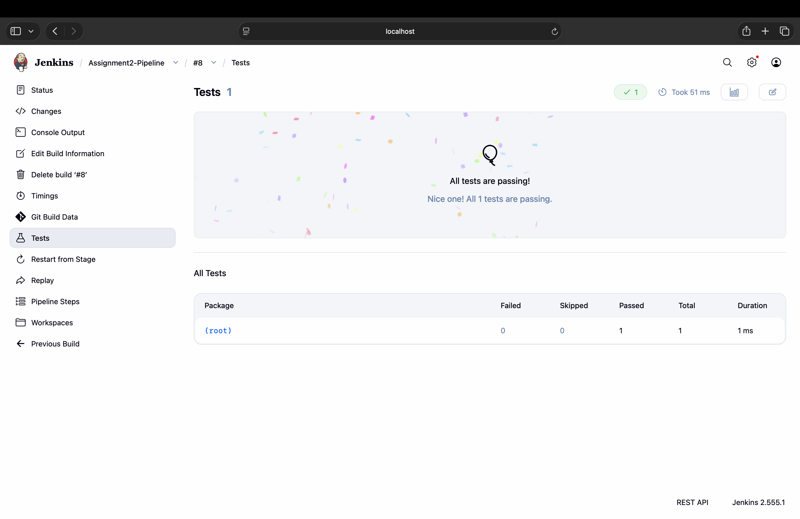
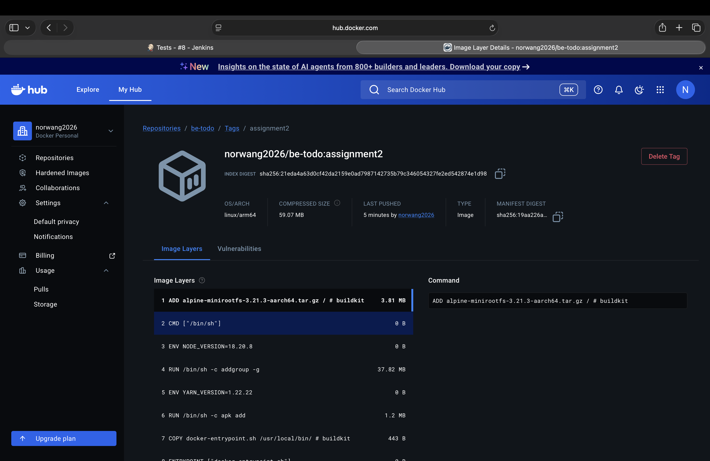
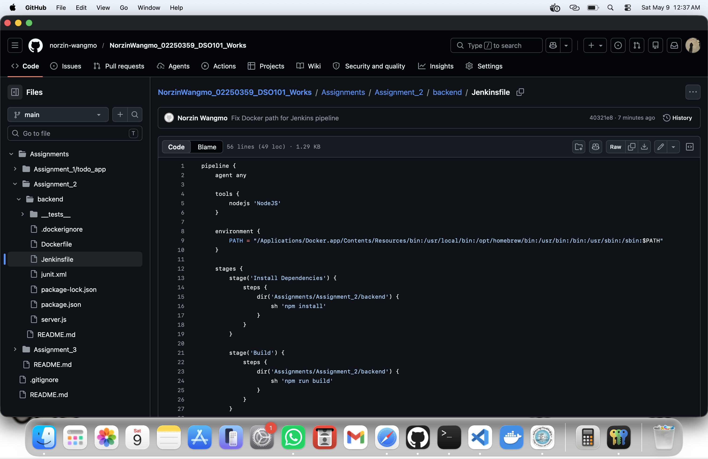

# DSO101 Assignment 2  
# CI/CD Pipeline Implementation Using Jenkins and Docker

---

# Student Information

- Name: Norzin Wangmo  
- Student ID: 02250359  
- Module: DSO101  
- Assignment: Assignment 2  
- Topic: Jenkins CI/CD Pipeline with Docker Integration  

---

# Introduction

Continuous Integration and Continuous Deployment (CI/CD) are important DevOps practices used in modern software development to automate the process of building, testing, and deploying applications. CI/CD helps developers reduce manual work, improve software quality, detect errors early, and deploy applications faster and more reliably.

In this assignment, a complete CI/CD pipeline was implemented using Jenkins, GitHub, Docker, Node.js, and Docker Hub. The project involved creating a backend Node.js application, configuring Jenkins pipelines, integrating GitHub repositories, building Docker images, executing automated tests, and pushing Docker images to Docker Hub automatically through Jenkins.

The assignment also focused on solving real-world DevOps problems such as Jenkins configuration issues, Docker environment setup, credential management, pipeline debugging, and automated testing integration.

---

# Objectives

The main objectives of this assignment are:

- To understand the concept of CI/CD pipelines.
- To install and configure Jenkins.
- To integrate GitHub with Jenkins.
- To automate application build and testing processes.
- To create Docker images automatically using Jenkins.
- To push Docker images to Docker Hub.
- To implement automated testing using Jest.
- To gain practical knowledge of DevOps tools and workflows.

---

# Technologies and Tools Used

The following technologies and tools were used during the assignment:

| Technology / Tool | Purpose |
|-------------------|----------|
| Jenkins | CI/CD automation server |
| GitHub | Source code repository |
| Docker | Containerization platform |
| Docker Hub | Docker image repository |
| Node.js | Backend runtime environment |
| Jest | Testing framework |
| VS Code | Code editor |
| macOS | Operating system |

---

# Project Structure

The project was organized using separate assignment folders to maintain proper structure and isolation between assignments.

```text
Assignments/
│
├── Assignment_1/
│
├── Assignment_2/
│   └── backend/
│       ├── Dockerfile
│       ├── Jenkinsfile
│       ├── package.json
│       ├── package-lock.json
│       ├── server.js
│       ├── junit.xml
│       ├── .dockerignore
│       └── __tests__/
│           └── app.test.js
│
└── Assignment_3/
```

---

# Step-by-Step Implementation

# Step 1: Creating Assignment_2 Folder

A separate folder named `Assignment_2` was created inside the `Assignments` directory. This was done to keep the assignment organized and separate from previous projects.

The backend application was then copied into the new folder structure.

---

# Step 2: Backend Setup

The backend project files were placed inside:

```text
Assignments/Assignment_2/backend
```

The backend contained:

- Express server
- Package configuration
- Dockerfile
- Jenkinsfile
- Jest testing setup

Dependencies were installed using the following command:

```bash
npm install
```

Development dependencies for testing were installed using:

```bash
npm install --save-dev jest jest-junit
```

The installation completed successfully without vulnerabilities.

---

# Step 3: Jest Testing Configuration

Automated testing was configured using Jest.

A test folder named `__tests__` was created and a basic test file was added.

Example test:

```javascript
test('basic test works', () => {
  expect(1 + 1).toBe(2);
});
```

Testing was executed using:

```bash
npm test
```

The test executed successfully and generated test reports.

---

# Step 4: Docker Configuration

Docker was used to containerize the backend application.

A Dockerfile was created to define the container environment.

Dockerfile:

```dockerfile
FROM node:18-alpine

WORKDIR /app

COPY package*.json ./

RUN npm install

COPY . .

EXPOSE 5000

CMD ["node", "server.js"]
```

The Docker image was built using:

```bash
docker build -t norwang2026/be-todo:assignment2 .
```

The image was successfully created.

---

# Step 5: Docker Hub Integration

The Docker image was pushed to Docker Hub.

Command used:

```bash
docker push norwang2026/be-todo:assignment2
```

The image upload completed successfully and became available in Docker Hub repositories.

---

# Step 6: Jenkins Installation

Jenkins was installed locally on macOS.

After installation, Jenkins was accessed using:

```text
http://localhost:8080
```

The initial Jenkins setup included:

- Unlocking Jenkins
- Installing suggested plugins
- Creating admin user
- Accessing Jenkins dashboard

---

# Step 7: NodeJS Configuration in Jenkins

NodeJS tool configuration was added inside Jenkins.

Steps performed:

1. Opened Manage Jenkins
2. Selected Tools
3. Added NodeJS installation
4. Enabled automatic installation
5. Selected NodeJS version
6. Saved configuration

This allowed Jenkins to use Node.js during pipeline execution.

---

# Step 8: GitHub Credentials Configuration

GitHub credentials were configured inside Jenkins for repository access.

Steps performed:

1. Opened Manage Jenkins
2. Selected Credentials
3. Added global credentials
4. Selected Username with Password
5. Entered GitHub username
6. Entered GitHub Personal Access Token
7. Saved credentials as:

```text
GitHub-creds
```

---

# Step 9: Docker Hub Credentials Configuration

Docker Hub credentials were also configured.

Steps performed:

1. Opened Jenkins Credentials
2. Added new credentials
3. Entered Docker Hub username
4. Entered Docker Hub password
5. Saved credentials as:

```text
docker-hub-creds
```

---

# Step 10: Pipeline Job Creation

A new Jenkins Pipeline project was created.

Pipeline settings:

- Pipeline type selected
- GitHub repository connected
- Jenkinsfile path configured
- SCM selected as Git

Repository used:

```text
https://github.com/norzin-wangmo/NorzinWangmo_02250359_DSO101_Works.git
```

---

# Step 11: Jenkinsfile Implementation

The Jenkinsfile automated the complete CI/CD workflow.

The pipeline stages included:

- Install Dependencies
- Build
- Test
- Docker Build
- Docker Push

---

# Jenkinsfile Used

```groovy
pipeline {
    agent any

    tools {
        nodejs 'NodeJS'
    }

    environment {
        PATH = "/Applications/Docker.app/Contents/Resources/bin:/usr/local/bin:/opt/homebrew/bin:/usr/bin:/bin:/usr/sbin:/sbin:$PATH"
    }

    stages {

        stage('Install Dependencies') {
            steps {
                dir('Assignments/Assignment_2/backend') {
                    sh 'npm install'
                }
            }
        }

        stage('Build') {
            steps {
                dir('Assignments/Assignment_2/backend') {
                    sh 'npm run build'
                }
            }
        }

        stage('Test') {
            steps {
                dir('Assignments/Assignment_2/backend') {
                    sh 'npm test'
                }
            }

            post {
                always {
                    junit 'Assignments/Assignment_2/backend/junit.xml'
                }
            }
        }

        stage('Docker Build') {
            steps {
                dir('Assignments/Assignment_2/backend') {
                    sh 'docker build -t norwang2026/be-todo:assignment2 .'
                }
            }
        }

        stage('Docker Push') {
            steps {
                sh 'docker push norwang2026/be-todo:assignment2'
            }
        }
    }
}
```

---

# Problems Encountered During Implementation

Several issues were encountered during the assignment implementation.

## Incorrect Backend Path

Initially Jenkins could not locate the package.json file because the backend directory path inside the Jenkinsfile was incorrect.

Error:

```text
npm ERR! enoent Could not read package.json
```

This problem was solved by updating the correct backend directory path inside the Jenkinsfile.

---

## Docker Not Found Error

Jenkins was unable to detect Docker initially.

Error:

```text
docker: command not found
```

This issue occurred because Docker’s binary path was not included in Jenkins environment variables.

The problem was fixed by adding the Docker PATH manually inside the Jenkinsfile environment section.

---

## Jenkinsfile Syntax Errors

Several syntax mistakes caused Jenkins pipeline failures.

Error example:

```text
expecting '}', found ''
```

This was fixed by carefully correcting missing brackets and stage structures.

---

## Credential Configuration Problems

GitHub and Docker Hub authentication initially failed because credentials were not configured correctly.

The problem was solved by:

- Creating Personal Access Tokens
- Configuring Jenkins credentials properly
- Assigning correct credential IDs

---

# Final Output

The CI/CD pipeline executed successfully.

The final successful pipeline performed:

- Dependency installation
- Application build
- Automated testing
- Docker image creation
- Docker image push to Docker Hub

Jenkins displayed successful build status with green indicators.

Docker Hub repository also showed the uploaded image successfully.

---

# Screenshots

## 1. Jenkins NodeJS Tool Configuration



---

## 2. GitHub Credentials Configuration



---

## 3. Docker Hub Credentials Configuration



---

## 4. Jenkins Pipeline Configuration



---

## 5. Initial Jenkins Failure Output



---

## 6. Successful Jenkins Pipeline Output



---

## 7. Jenkins Dashboard Success Status



---

## 8. Jenkins Test Results



---

## 9. Docker Hub Repository



---

## 10. GitHub Jenkinsfile



---

# Conclusion

This assignment successfully demonstrated the implementation of a complete CI/CD pipeline using Jenkins, Docker, GitHub, and Node.js. The project automated important software development tasks including dependency installation, application build, testing, Docker image creation, and Docker image deployment.

The assignment provided practical experience in DevOps concepts and real-world troubleshooting. Multiple technical challenges such as Docker environment configuration, Jenkins pipeline debugging, credential management, and directory path issues were identified and resolved during implementation.

Through this assignment, important knowledge was gained regarding CI/CD automation, containerization, Jenkins pipeline scripting, and Docker Hub integration. The successful pipeline execution confirmed that the backend application could be automatically tested, containerized, and deployed using DevOps tools.

Overall, the assignment improved understanding of continuous integration workflows and demonstrated how automation can simplify software development and deployment processes.

---

# References

1. Jenkins Documentation  
   https://www.jenkins.io/doc/

2. Docker Documentation  
   https://docs.docker.com/

3. Node.js Documentation  
   https://nodejs.org/en/docs

4. Jest Documentation  
   https://jestjs.io/docs/getting-started

5. GitHub Documentation  
   https://docs.github.com/

6. Docker Hub Documentation  
   https://hub.docker.com/

7. Visual Studio Code Documentation  
   https://code.visualstudio.com/docs