# DSO101 Assignment 3 – CI/CD Pipeline using Docker, GitHub Actions, DockerHub and Render

## Student Information

- Name: Norzin Wangmo
- Student Number: 02250359 
- Module: DSO101
- Assignment: Assignment 3
- Topic: CI/CD Pipeline with Docker and Cloud Deployment

---

# Project Overview

This project demonstrates a complete CI/CD (Continuous Integration and Continuous Deployment) pipeline using:

- Node.js
- Express.js
- Docker
- DockerHub
- GitHub Actions
- Render.com

The application is containerized using Docker and automatically deployed whenever changes are pushed to GitHub.

---

# Technologies Used

| Technology | Purpose |
|---|---|
| Node.js | Backend Runtime |
| Express.js | Web Framework |
| Docker | Containerization |
| DockerHub | Image Registry |
| GitHub Actions | CI/CD Automation |
| Render.com | Cloud Deployment |
| GitHub | Version Control |

---

# Project Structure

```bash
Assignment_3/
│
├── .github/
│   └── workflows/
│       └── deploy.yml
│
├── Dockerfile
├── package.json
├── package-lock.json
├── server.js
├── README.md
└── .gitignore
```

---

# Step 1: Initialize Node.js Project

The following command was used to initialize the Node.js application.

```bash
npm init -y
```

This creates the `package.json` file which stores project configuration and dependencies.

---

# Step 2: Install Express.js

```bash
npm install express
```

Express.js was installed to create the backend server.

---

# Step 3: Create server.js

```js
const express = require("express");

const app = express();

const PORT = 3000;

app.get("/", (req, res) => {
  res.send("Todo App is running successfully!");
});

app.listen(PORT, () => {
  console.log(`Server is running on port ${PORT}`);
});
```

This file creates a simple backend server.

---

# Step 4: Update package.json

```json
{
  "name": "dso101-assignment-3",
  "version": "1.0.0",
  "description": "DSO101 Assignment 3 CI/CD with DockerHub and Render",
  "main": "server.js",
  "scripts": {
    "start": "node server.js",
    "test": "echo \"No tests yet\" && exit 0"
  },
  "dependencies": {
    "express": "^5.2.1"
  }
}
```

The `start` script allows the application to run using:

```bash
npm start
```

---

# Step 5: Run the Application

```bash
npm start
```

Output:

```bash
Server is running on port 3000
```

The application was tested in the browser using:

```bash
http://localhost:3000
```

---

# Step 6: Create Dockerfile

```dockerfile
FROM node:20

WORKDIR /app

COPY package*.json ./

RUN npm install

COPY . .

EXPOSE 3000

CMD ["npm", "start"]
```

This Dockerfile creates a Docker image for the application.

---

# Step 7: Build Docker Image

```bash
docker build -t norwang2026/todo-app:latest .
```

This command builds the Docker image.

---

# Step 8: Check Docker Images

```bash
docker images
```

This verifies whether the Docker image was successfully created.

---

# Step 9: Run Docker Container

```bash
docker run -p 3001:3000 norwang2026/todo-app:latest
```

This maps container port 3000 to local port 3001.

Application testing URL:

```bash
http://localhost:3001
```

---

# Step 10: Push Image to DockerHub

Login to DockerHub:

```bash
docker login
```

Push image:

```bash
docker push norwang2026/todo-app:latest
```

This uploads the Docker image to DockerHub.

---

# Step 11: Create GitHub Actions Workflow

File Location:

```bash
.github/workflows/deploy.yml
```

Workflow Code:

```yaml
name: Build, Push and Deploy

on:
  push:
    branches:
      - main

jobs:
  build-and-deploy:
    runs-on: ubuntu-latest

    defaults:
      run:
        working-directory: Assignments/Assignment_3

    steps:
      - name: Checkout Repository
        uses: actions/checkout@v4

      - name: Login to DockerHub
        uses: docker/login-action@v3
        with:
          username: ${{ secrets.DOCKERHUB_USERNAME }}
          password: ${{ secrets.DOCKERHUB_TOKEN }}

      - name: Build Docker Image
        run: docker build --platform linux/amd64 -t norwang2026/todo-app:latest .

      - name: Push Docker Image
        run: docker push norwang2026/todo-app:latest

      - name: Trigger Render Deployment
        run: curl -X POST "${{ secrets.RENDER_DEPLOY_HOOK }}"
```

This workflow automatically:
- Builds Docker image
- Pushes image to DockerHub
- Deploys application to Render

---

# Step 12: Configure GitHub Secrets

The following secrets were added in GitHub:

| Secret Name | Purpose |
|---|---|
| DOCKERHUB_USERNAME | DockerHub Username |
| DOCKERHUB_TOKEN | DockerHub Access Token |
| RENDER_DEPLOY_HOOK | Render Deployment Hook URL |

---

# Step 13: Deploy on Render

Render.com was connected with DockerHub image:

```bash
norwang2026/todo-app:latest
```

Deployment URL:

```bash
https://dso101-assignment-3.onrender.com
```

---

# Output Screenshots

## 1. VS Code Project Structure

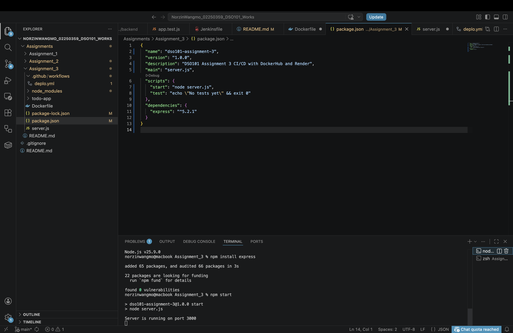

---

## 2. Running Node.js Application

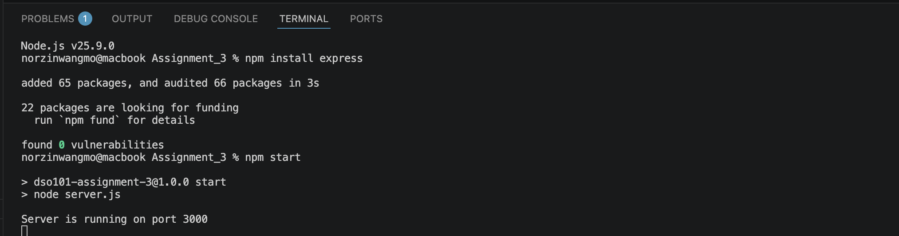

---

## 3. Docker Build Output

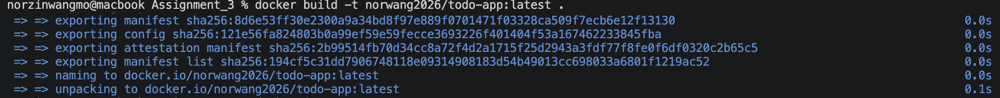

---

## 4. Docker Images

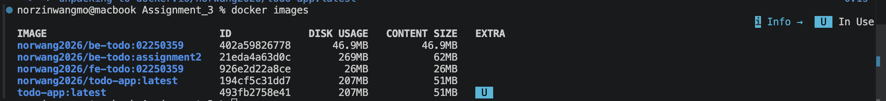

---

## 5. Running Docker Container

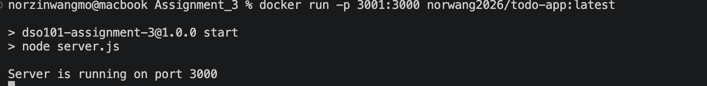

---

## 6. Localhost Browser Output

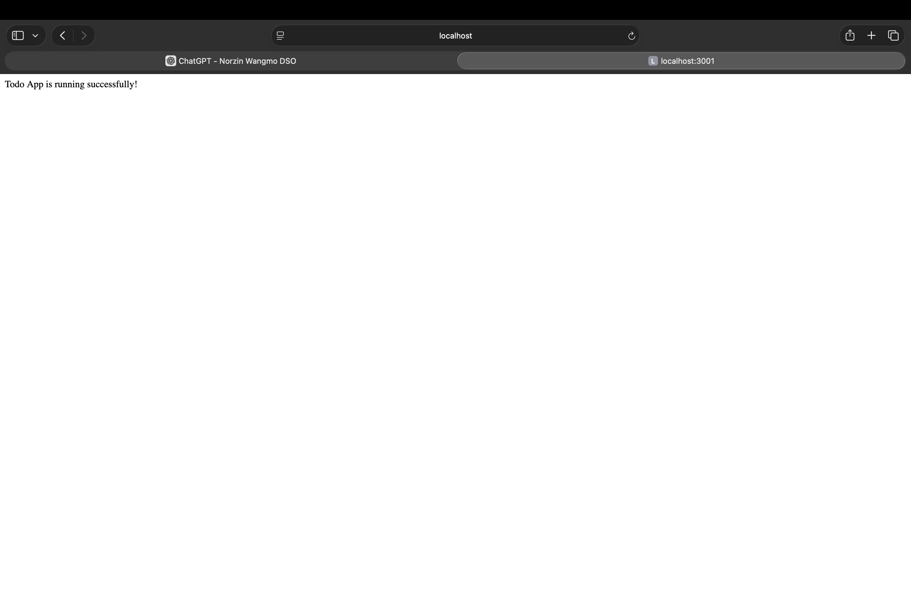

---

## 7. Docker Login

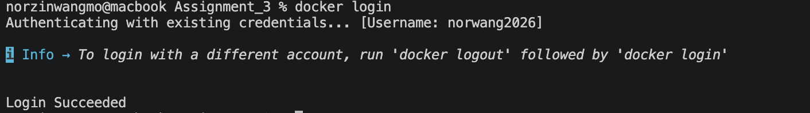

---

## 8. Docker Push Output

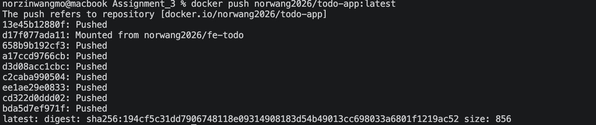

---

## 9. DockerHub Repository

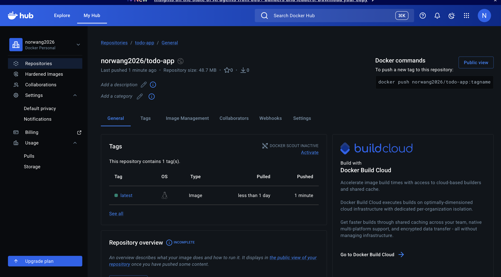
---

## 10. Git Push to GitHub

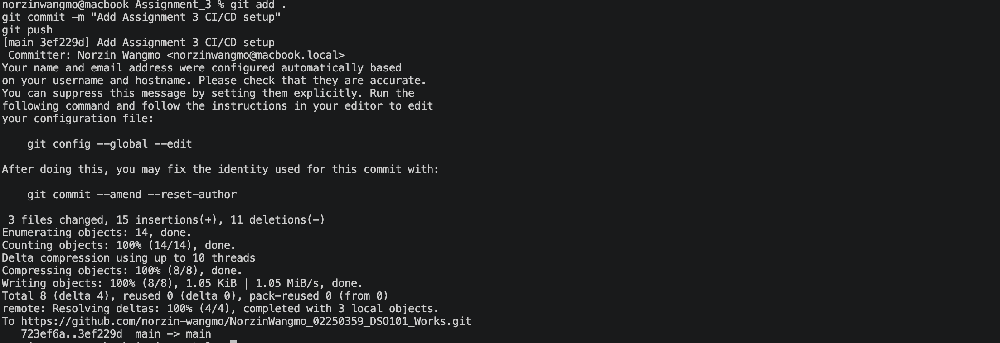

---

## 11. Render Deployment Logs

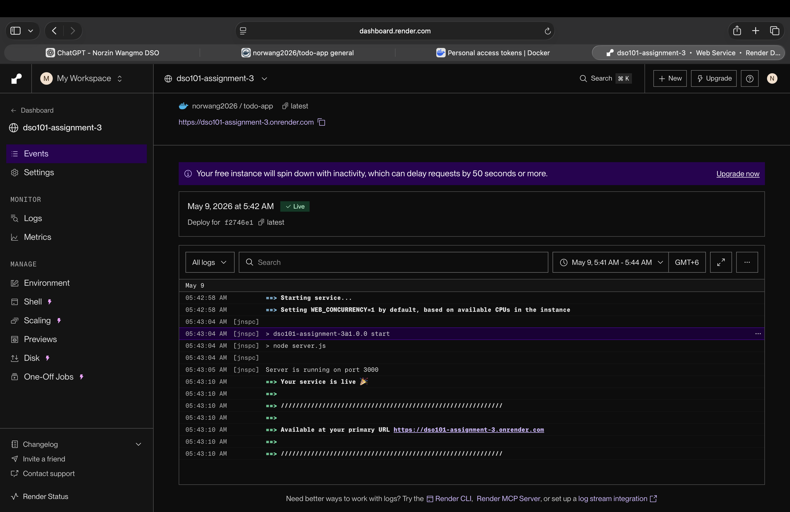

---

## 12. Render Live Application

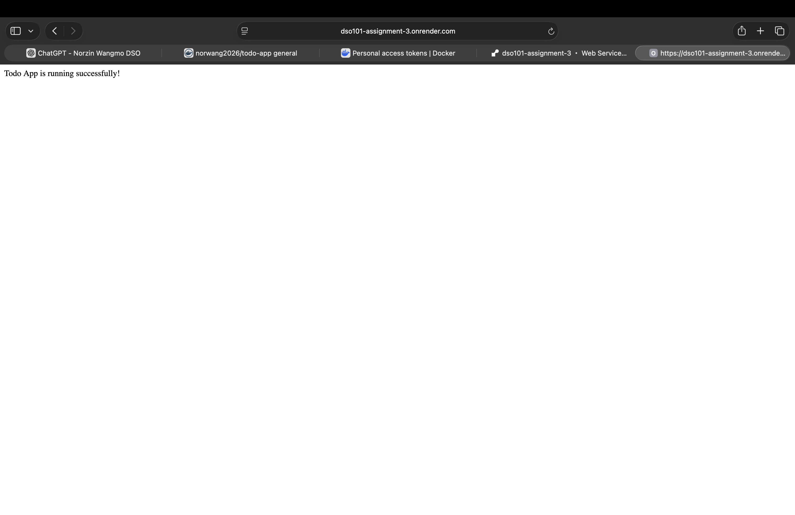

---

## 13. GitHub Actions Initial Workflow Page

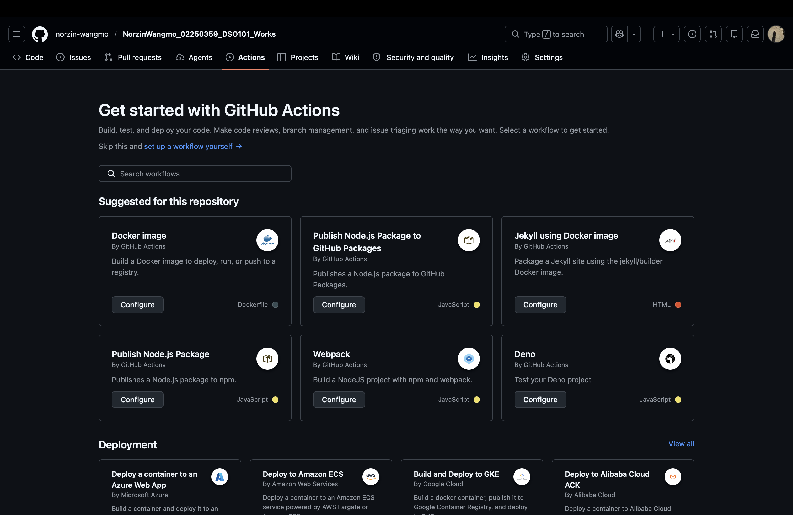

---

## 14. GitHub Actions Failed Workflow

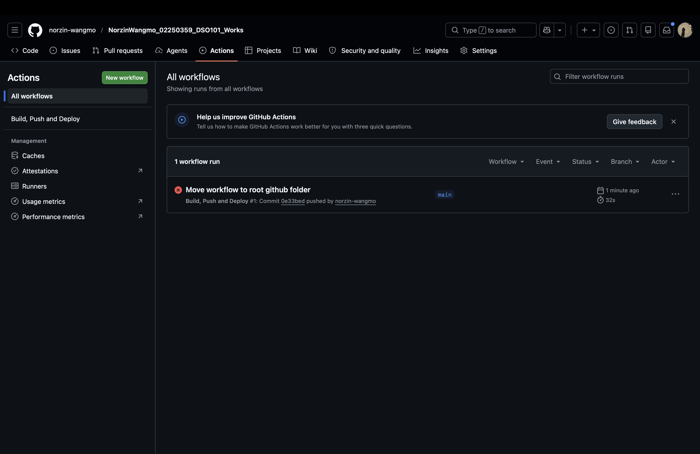

---

## 15. GitHub Actions Successful Workflow

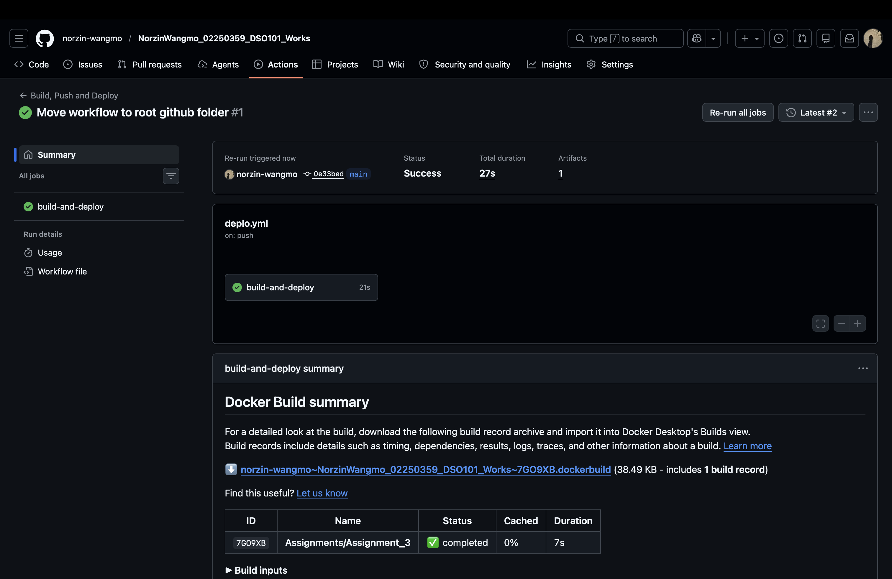

---

# Challenges Faced

During the implementation process, several issues were encountered:

- JSON parsing errors in `package.json`
- Missing Express.js dependency
- Docker port conflicts
- GitHub Actions workflow path issues
- Invalid Docker platform architecture
- Render deployment configuration problems

All issues were solved successfully through debugging and configuration updates.

---

# Conclusion

This assignment successfully demonstrated the implementation of a complete CI/CD pipeline using Docker, DockerHub, GitHub Actions, and Render.com. The Node.js application was containerized using Docker and automatically deployed through GitHub Actions whenever code was pushed to the GitHub repository. DockerHub was used as the image registry while Render.com handled cloud deployment and hosting. During the implementation process, several practical issues such as missing dependencies, port conflicts, workflow configuration errors, and platform compatibility problems were identified and resolved successfully. Overall, this assignment provided valuable hands-on experience in DevOps practices, automation, containerization, continuous integration, and continuous deployment used in modern software development environments.

---

# References

1. Docker Documentation  
https://docs.docker.com/

2. GitHub Actions Documentation  
https://docs.github.com/en/actions

3. Render Documentation  
https://render.com/docs

4. Node.js Documentation  
https://nodejs.org/en/docs

5. Express.js Documentation  
https://expressjs.com/
