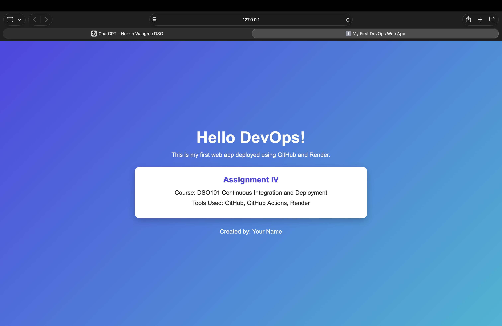
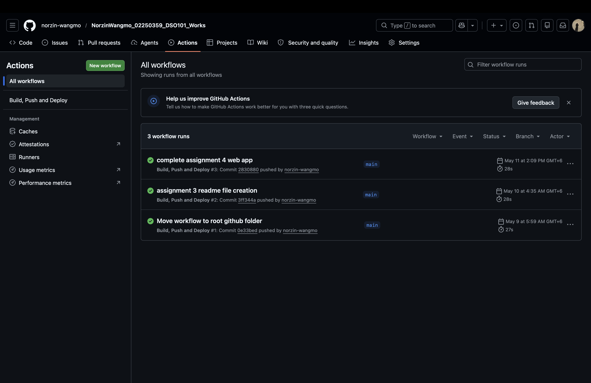
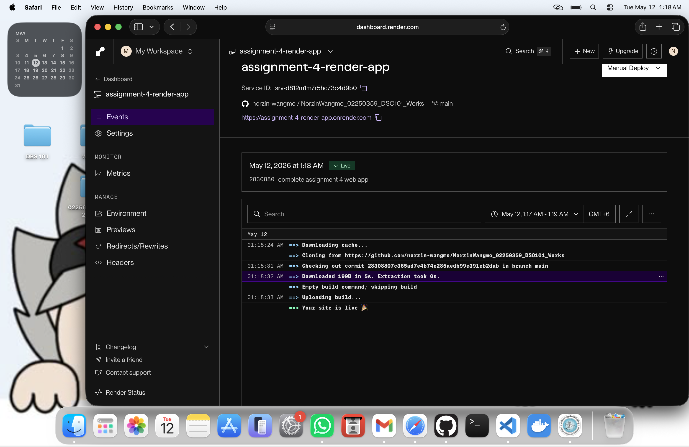

# Assignment IV – Deploy Your First Web App using GitHub & Render

## Student Information

- **Name:** Norzin Wangmo  
- **Student Number:** 02250359 
- **Module:** DSO101 – Continuous Integration and Continuous Deployment  
- **Assignment:** Assignment IV  
- **Project Folder:** assignment-4-render-app  

---

# Introduction

This project was developed as part of Assignment IV for the DSO101 module. The main objective of this assignment is to understand the basic concepts of Continuous Integration and Continuous Deployment (CI/CD) using GitHub Actions and Render.

In this assignment, a simple static web application was created using HTML and CSS. The application was uploaded to GitHub, automated using GitHub Actions workflow, and successfully deployed on Render. The assignment helped in understanding how developers automate software deployment processes and maintain cloud-hosted applications.

The project also provided practical experience with version control systems, repository management, workflow automation, and cloud deployment services. Through this assignment, important DevOps concepts such as automation, deployment pipelines, and continuous integration were explored practically.

---

# Objectives

The objectives of this assignment are:

- To learn the basics of Git and GitHub
- To understand the concept of Continuous Integration and Continuous Deployment (CI/CD)
- To create a simple static web application
- To automate workflows using GitHub Actions
- To deploy websites using Render
- To gain practical experience in software deployment and automation
- To understand modern DevOps workflows and deployment pipelines

---

# Tools and Technologies Used

The following tools and technologies were used during this assignment:

- HTML
- CSS
- Git
- GitHub
- GitHub Actions
- Render
- VS Code
- Live Server Extension

---

# Project Structure

```text
assignment-4-render-app/
│
├── index.html
├── style.css
├── README.md
└── .github/
    └── workflows/
        └── deploy.yml
```

---

# Web Application Description

A simple responsive webpage was developed using HTML and CSS. The webpage displays a welcoming DevOps message along with assignment information and deployment details. The application was designed with a clean and modern user interface to improve visual appearance and readability.

The webpage contains:

- Main heading
- Assignment title
- Course information
- Deployment information
- Author name

The webpage design includes:

- Gradient background
- Responsive centered layout
- Card-based interface
- Modern typography
- Shadow effects and spacing

The application was tested locally using the Live Server extension before deployment.

---

# GitHub Repository Setup

The project files were uploaded to GitHub using Git commands through the VS Code terminal. GitHub was used as the version control platform to manage and store project files online.

## Git Commands Used

```bash
git init
git add .
git commit -m "complete assignment 4 web app"
git branch -M main
git push -u origin main
```

These commands initialized the Git repository, added project files, committed the changes, and pushed the project to the GitHub repository.

---

# GitHub Actions Workflow

A GitHub Actions workflow was created to automate the Continuous Integration process. The workflow automatically runs whenever code is pushed to the `main` branch of the repository.

## Workflow File Location

```text
.github/workflows/deploy.yml
```

## Workflow Code

```yaml
name: Deploy to Render

on:
  push:
    branches: [ "main" ]

jobs:
  deploy:
    runs-on: ubuntu-latest

    steps:
      - name: Checkout code
        uses: actions/checkout@v3

      - name: Dummy step
        run: echo "Code pushed successfully!"
```

The workflow verifies that code has been successfully pushed to the repository. GitHub Actions provided automation support and helped in understanding CI/CD workflow execution.

---

# Render Deployment

The GitHub repository was connected to Render and deployed as a Static Site. Render automatically fetched the repository files and hosted the website online.

## Render Configuration

| Setting | Value |
|---|---|
| Service Type | Static Site |
| Branch | main |
| Build Command | Empty |
| Publish Directory | . |

The deployment was successful and Render generated a live public URL for the website.

---

# GitHub Repository Link

```text
https://github.com/norzin-wangmo/NorzinWangmo_02250359_DSO101_Works
```

---

# Live Deployed URL

```text
https://assignment-4-render-app.onrender.com
```

---

# Screenshots

## 1. Local Web Application Running



---

## 2. GitHub Actions Workflow Success



---

## 3. Render Deployment Dashboard



---

## 4. Final Live Deployed Website


---

# Steps Followed

1. Created a project folder named `assignment-4-render-app`.
2. Opened the project folder using VS Code.
3. Created `index.html` and `style.css`.
4. Designed the webpage using HTML and CSS.
5. Tested the webpage locally using Live Server.
6. Initialized a Git repository using Git commands.
7. Uploaded project files to GitHub.
8. Created GitHub Actions workflow file.
9. Verified GitHub Actions workflow execution.
10. Connected GitHub repository to Render.
11. Configured Render Static Site deployment settings.
12. Successfully deployed the website online.
13. Verified the live deployment URL.

---

# Challenges Faced

Several challenges were encountered during the completion of this assignment. Initially, there was confusion regarding the use of Live Server because the “Open with Live Server” option was not visible in VS Code. This issue was solved by installing the Live Server extension and restarting VS Code.

Another challenge was understanding how GitHub Actions workflows operate. Creating the correct folder structure for `.github/workflows/deploy.yml` required careful attention because even small mistakes in the folder path could prevent the workflow from running correctly.

During deployment, there was confusion regarding Render configuration settings such as Root Directory, Publish Directory, and Environment Variables. Since the repository contained multiple assignments, it was necessary to specify the correct assignment folder while deploying the project on Render. Incorrect configuration initially caused uncertainty about whether the correct assignment was being deployed.

There was also confusion regarding whether environment variables were required for the project. After troubleshooting, it was understood that static websites using only HTML and CSS do not require environment variables or build commands.

Another challenge involved verifying whether the deployment was truly successful. Careful checking of GitHub Actions workflow status, Render deployment logs, and the live website URL was required to ensure that the application was fully deployed and functioning correctly.

Despite these challenges, all issues were solved successfully through troubleshooting, repeated testing, and proper configuration. These challenges provided valuable practical experience in deployment workflows, GitHub repository management, workflow automation, and cloud hosting services.

---

# Conclusion

This assignment provided practical understanding of Continuous Integration and Continuous Deployment using GitHub Actions and Render. Through this project, important DevOps concepts such as workflow automation, deployment pipelines, repository management, and cloud hosting were explored practically.

The assignment also improved understanding of Git commands, GitHub repository management, CI/CD workflow execution, and online deployment services. Creating and deploying a static web application helped in understanding how developers automate software delivery processes in modern development environments.

Overall, this assignment was highly useful in developing practical DevOps knowledge and deployment skills. It provided hands-on experience with real-world tools and improved confidence in managing deployment workflows and cloud-hosted applications.

---

# References

1. Git Documentation  
https://git-scm.com/doc

2. GitHub Actions Documentation  
https://docs.github.com/en/actions

3. Render Documentation  
https://render.com/docs

4. MDN Web Docs  
https://developer.mozilla.org/

5. DSO101 Assignment IV Handout